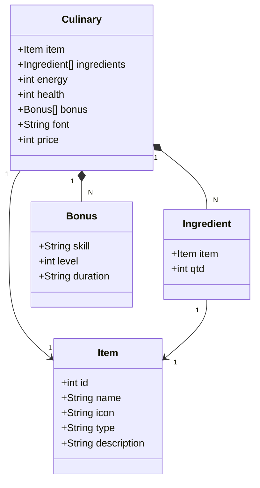

# API do jogo Stardew Valley
Java REST API

- v0.1 - Itens de Culinária
- v0.2 - Peixes

## Diagrama de Classes

```mermaid
classDiagram
    class Culinary {
        +Item item
        +Ingredient[] ingredients
        +int energy
        +int health
        +Bonus[] bonus
        +String font
        +int price
    }

    class Item {
        +int id
        +String name
        +String icon
        +String type
        +String description
    }

    class Ingredient {
        +Item item
        +int qtd
    }

    class Bonus {
        +String skill
        +int level
        +String duration
    }

    Culinary "1" --> "1" Item
    Culinary "1" *-- "N" Ingredient
    Culinary "1" *-- "N" Bonus
    Ingredient "1" --> "1" Item 
```